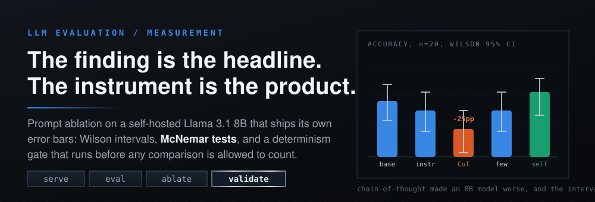
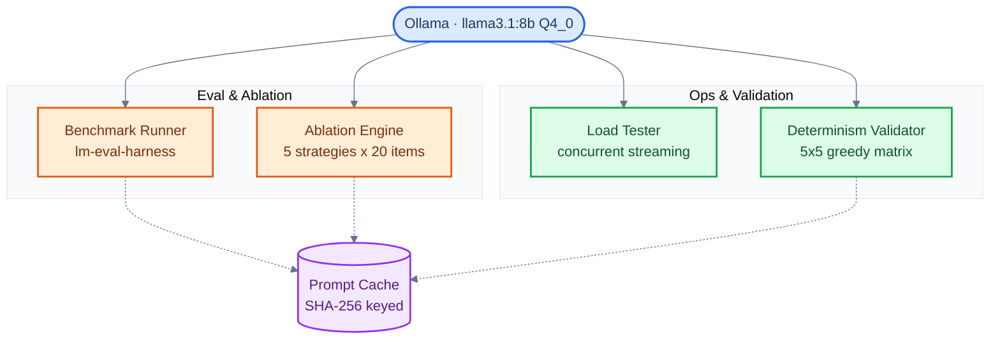

<p align="center">
  
</p>

<div align="center">

<b><font size="6">Self-Hosted LLM Evals Lab</font></b>

<br/>


<br/><br/>

<strong>A prompt-ablation harness for self-hosted LLMs that reports its own uncertainty.</strong><br/>
The interesting part is not that chain-of-thought cost this model 25 points of accuracy.<br/>
It is that the same harness says, in the same breath, that n=20 is not enough to prove it.

<br/>

<code>serve -> eval -> ablate -> validate</code>

</div>

---

## The 90 second tour

- [The headline finding](#chain-of-thought-made-the-model-worse): every layer of prompt scaffolding made an 8B model less accurate, and self-consistency voting was the only strategy that recovered anything
- [The part that pays rent](#vote-confidence-is-a-routing-signal): the vote confidence from self-consistency separates the answers you can trust from the ones worth escalating to a bigger model
- Run the whole pipeline yourself in two commands: `make setup && make ablation`

## Why the error bars are the point

A number without an interval is a claim without a receipt. It cannot tell you whether you measured an effect or got lucky on twenty questions, and at the sample sizes most local eval runs can afford, that difference is the entire story.

So this harness refuses to report an accuracy on its own. Every proportion comes back with a Wilson score interval. Every paired comparison against baseline goes through McNemar's test. Every run is gated behind a determinism check first, because an ablation across prompts means nothing if the same prompt does not return the same answer twice.

That discipline is what produced the honest version of the headline below. Chain-of-thought was the largest effect in the table. It was also, at this sample size, statistically indistinguishable from noise. Both sentences are true, and a harness that prints only the first one is selling you something.

| Guard | The question it answers | What it catches |
|---|---|---|
| **Wilson interval** | How precise is this accuracy, really? | A 60% that is actually somewhere between 39% and 78% |
| **McNemar's test** | Did this strategy beat baseline, or did the same items just shuffle? | A win that came from four items changing hands, not from a better prompt |
| **Determinism gate** | Would this prompt score the same way twice? | Sampling noise being read as a prompt effect |
| **SHA-256 prompt cache** | Is the comparison replaying identical calls or re-rolling them? | A rerun that quietly measures a different experiment |

## Chain-of-thought made the model worse

Accuracy decreased monotonically with prompt complexity. Each added layer of instruction degraded performance, and the most sophisticated single-pass strategy was the worst of the five.

| Strategy | Accuracy | 95% CI | vs Baseline |
|---|---|---|---|
| Baseline (minimal template) | 60% (12/20) | [0.39, 0.78] | reference |
| Instruction template | 55% (11/20) | [0.34, 0.74] | -5pp |
| Chain-of-thought | 35% (7/20) | [0.18, 0.57] | **-25pp** |
| Few-shot + CoT | 55% (11/20) | [0.34, 0.74] | -5pp |
| Self-consistency (k=5) | **70% (14/20)** | **[0.48, 0.85]** | **+10pp** |


At 8B parameters the model pattern-matches commonsense completions well, then reasons itself out of a correct first-pass answer when asked to think step by step. Few-shot examples recovered part of that loss by constraining the output format and capping how far the reasoning wandered.

The honest caveat, stated as loudly as the finding: McNemar's test on the winning strategy against baseline returns p=0.48. At n=20 this is directionally interesting and statistically unproven. The confidence intervals overlap heavily, which is exactly what a 20-item run should look like.

## Vote confidence is a routing signal

Self-consistency was the only strategy that beat baseline: five samples at temperature 0.7, majority vote, +10pp for 5x the latency. On a pure accuracy-per-dollar basis that is a bad trade.

The vote itself is the thing worth keeping. How lopsided the five samples were turns out to predict whether the answer is right:


- Confidence at or above 0.8: nearly always correct. Serve it from the small model.
- Confidence at or below 0.6: close to a coin flip. Escalate to a larger endpoint.

That is a production cascade you can actually build. Run the cheap model with self-consistency, keep the high-confidence answers, and spend the expensive model's budget only on the minority of items where the small model is visibly unsure.

## Performance profile

| Config | TTFT P50 (ms) | Throughput (tok/s) | Concurrency |
|---|---|---|---|
| Short, c=1 | ~132 | ~65 | 1 |
| Short, c=3 | ~596 | ~68 | 3 |
| Short, c=5 | ~4531 | ~66 | 5 |
| Long, c=1 | ~190 | ~63 | 1 |


TTFT scales linearly with concurrency while throughput stays flat, which is the signature of a backend that queues rather than batches. Ollama serves requests sequentially, so concurrency buys nothing here. A continuous-batching backend such as vLLM or TGI is the next step for any real load.

TTFT is measured from the first non-empty streamed chunk. Throughput comes from Ollama's own `eval_count / eval_duration`. The first request of each run is excluded as cold-start model load.

## Architecture



Every (model, prompt, params) call is hashed with `SHA-256(JSON.dumps({"model": m, "prompt": p, **params}, sort_keys=True))` and cached to `.cache/{hash}.json`. Repeated evaluations hit the cache instead of the inference endpoint, which is what keeps an ablation affordable and makes a rerun replay the same experiment instead of a new one.

## Quick start

```bash
make setup     # venv + deps + pull model
make serve     # start the Ollama endpoint
make eval      # MMLU + HellaSwag benchmarks
make ablation  # prompt strategy ablation
make perf      # load testing + latency analysis
make validate  # determinism checks
```

Point it at a different model with `MODEL=mistral:7b make eval`. Evals run in generative mode (`--model local-chat-completions`), so the backend does not need to expose logprobs. Anything speaking OpenAI-compatible `/v1/chat/completions` works.

## Methodology

- **Model**: Llama 3.1 8B, Q4_0 quantized, roughly 4.7 GB, served through Ollama
- **Decoding**: greedy baseline at temperature 0, top_p 1, top_k 1, seed 42. Self-consistency uses temperature 0.7, top_p 0.95, k=5, seeds 42 through 46
- **Benchmarks**: HellaSwag for commonsense completion, MMLU for knowledge, plus a custom JSON task
- **Ablation**: four prompting strategies on an identical 20-item subset, then self-consistency applied to the winning template
- **Answer extraction**: three-tier regex normalizing "A", "A.", "(A)", and "The answer is A"
- **Statistics**: Wilson score intervals for every proportion, McNemar's test for paired comparisons against baseline

<details>
<summary>Full decoding parameters, harness invocation, and formulas</summary>

### Decoding parameters

| Parameter | Greedy (baseline) | Self-consistency |
|---|---|---|
| temperature | 0 | 0.7 |
| top_p | 1.0 | 0.95 |
| top_k | 1 | 40 |
| seed | 42 | 42, 43, 44, 45, 46 |
| repeat_penalty | 1.0 | 1.0 |
| max_tokens | 128 | 128 |

### lm-eval-harness invocation

```bash
python -m lm_eval \
  --model local-chat-completions \
  --model_args model=llama3.1:8b,base_url=http://localhost:11434/v1/chat/completions,num_concurrent=1,max_retries=3,tokenized_requests=False \
  --apply_chat_template \
  --tasks hellaswag,mmlu \
  --limit 100 \
  --batch_size 1 \
  --seed 42 \
  --log_samples \
  --cache_requests true
```

### Answer extraction, three tiers

1. Direct letter at start: `^[(\s]*([A-Da-d])[).\s,:]`
2. Keyword pattern: `(?:answer|choice|option)[\s:]+(?:is\s+)?[(\s]*([A-Da-d])`
3. Standalone letter fallback: `\b([A-Da-d])\b`

### Statistical formulas

Wilson score interval:

```
center = (p + z^2/2n) / (1 + z^2/n)
spread = z * sqrt((p(1-p) + z^2/4n) / n) / (1 + z^2/n)
CI     = [center - spread, center + spread]
```

with z = 1.96 for 95% confidence, p the observed accuracy, n the sample size.

McNemar's chi-squared with continuity correction:

```
chi2 = (|b - c| - 1)^2 / (b + c)
```

where b is the count of items only baseline got right, c the count only the challenger got right, df = 1.

</details>

## What this cannot tell you

Stated plainly, because an eval harness that hides its own limits is the thing it was built to prevent.

- **Sample size.** n=20 produces confidence intervals 30 to 40 points wide. Detecting a 10pp effect at 80% power needs roughly 200 items. The chain-of-thought drop is large enough to be worth chasing; its exact magnitude is not established.
- **One model, one size.** Every number here is Llama 3.1 8B. The interesting open question is where the crossover sits, since chain-of-thought is known to help at larger scales. Mapping that needs 13B, 70B, and a mixture-of-experts model on the same harness.
- **Quantization is uncontrolled.** All results are on Q4_0 weights. Whether 4-bit quantization interacts with prompting strategy is untested here.
- **One task family.** The ablation ran on HellaSwag only. Chain-of-thought plausibly behaves differently on math, coding, and multi-step reasoning, where the reasoning chain is structurally load-bearing rather than decorative.
- **Backend ceiling.** Ollama's sequential queue means the concurrency numbers describe Ollama, not the model. Real serving characteristics need a batching backend.

## Project structure

```
self-hosted-llm-evals-lab/
├── Makefile                    # every command in this README
├── README.md
├── LICENSE
├── CONTRIBUTING.md
├── requirements.txt
│
├── assets/
│   └── hero.svg
│
├── serve/                      # inference server management
│   ├── serve.py                # Ollama lifecycle manager
│   └── client.py               # sample generation client
│
├── eval_runner/                # benchmark evaluation
│   ├── model.py                # model wrapper + SHA-256 prompt cache
│   ├── run_eval.py             # lm-eval-harness runner
│   └── custom_task/            # custom JSON benchmark definitions
│
├── ablation/                   # prompt strategy optimization
│   ├── prepare_data.py         # few-shot + template preparation
│   ├── optimize_prompt.py      # ablation across strategies
│   ├── infer.py                # comparison + statistical tests
│   ├── eval.sh                 # full pipeline
│   ├── results/                # ablation output, source of the figures
│   └── report.md               # detailed results + analysis
│
├── perf/                       # load testing
│   ├── load_test.py            # concurrent load generator
│   ├── metrics.csv             # raw metrics output
│   └── analysis.ipynb          # visualization notebook
│
├── validate/                   # determinism verification
│   ├── validate.py             # N-trial consistency + output validators
│   └── README.md               # testing methodology
│
└── docs/
    ├── REPORT.md               # extended research report
    ├── architecture.md         # system design
    ├── generate_figures.py     # regenerates every figure from raw results
    └── figures/                # chart exports
```

## License

Apache-2.0. See [LICENSE](LICENSE) and [NOTICE](NOTICE).
