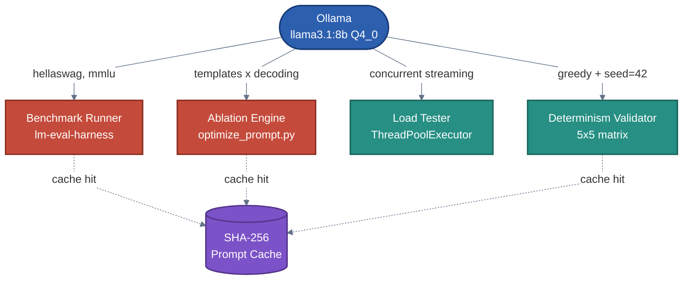

# self-hosted-llm-evals-lab

Eval, benchmark, and optimize open-source LLMs you self-host as APIs.


## The Problem

You downloaded an open-source LLM. You're serving it with Ollama or vLLM. But you're flying blind:

- You don't know how accurate it actually is on your tasks
- Every "prompt engineering tip" you followed might be making things worse (we found CoT drops accuracy 25pp on small models)
- You have no idea if it can handle real traffic
- You can't tell if outputs are even reproducible

This toolkit gives you answers before you ship to production.

## What This Does

- **Benchmark accuracy** (MMLU, HellaSwag, custom tasks) via [lm-eval-harness](https://github.com/EleutherAI/lm-evaluation-harness)
- **Load-test throughput**, TTFT, P50/P95/P99 latency under concurrency
- **Validate determinism** (greedy decoding + fixed seed, verified across 5x5 trials)
- **Optimize prompts** via systematic ablation (templates, CoT, few-shot, self-consistency voting)

Works with [Ollama](https://ollama.com), or any OpenAI-compatible `/v1/chat/completions` endpoint.

## Use Cases

- **"Is my model accurate enough?"** -- Run standardized benchmarks (MMLU, HellaSwag) on any model you're serving. Compare Llama vs Mistral vs Gemma on the same tasks.
- **"Are my prompts actually helping?"** -- Test whether chain-of-thought, few-shot, or instruction prompts improve or hurt your specific model. (Spoiler: at 8B parameters, simpler prompts win.)
- **"Can it handle production traffic?"** -- Load-test your endpoint with concurrent requests. Get P50/P95/P99 latency, TTFT, and throughput numbers before users hit it.
- **"Why does it give different answers each time?"** -- Validate determinism with reproducibility checks. Pin down greedy decoding + fixed seed to get consistent outputs.
- **"Which model should I deploy?"** -- Run the same eval suite across models and compare accuracy, latency, and throughput side-by-side.

## Quick Start

```bash
make setup     # venv + deps + pull model
make serve     # Start Ollama endpoint
make eval      # MMLU + HellaSwag benchmarks
make ablation  # Prompt strategy optimization
make perf      # Load testing + latency analysis
make validate  # Determinism checks
```

Override the model: `MODEL=mistral:7b make eval`

## Architecture



Every (model, prompt, params) call is SHA-256 hashed and cached to disk. Repeated evaluations hit the cache instead of the inference endpoint, which makes ablation runs efficient and results reproducible. Deterministic baselines (temperature=0, top_k=1, fixed seed) are enforced before any comparison.

## Key Findings

### Chain-of-thought hurts at small scale

We found that chain-of-thought prompting **drops accuracy by 25 percentage points** on Llama 3.1 8B. The model gets the right answer with a simple prompt, then reasons itself into the wrong one when asked to think step-by-step.

| Strategy | Accuracy | vs Baseline |
|---|---|---|
| Baseline (minimal template) | 60% | -- |
| Instruction template | 50% | -10pp |
| Chain-of-thought | 35% | **-25pp** |
| Few-shot + CoT | 55% | -5pp |
| Self-consistency (k=5) | **70%** | **+10pp** |


Accuracy decreased monotonically with prompt complexity. Each added layer of instruction degraded performance. At 8B parameters, the model pattern-matches commonsense completions effectively, but explicit reasoning chains introduce noise that overrides correct first-pass answers.

Few-shot examples partially recovered CoT losses (35% to 55%) by constraining output format and reasoning depth.

### Self-consistency and confidence routing

Self-consistency (5 samples at temperature=0.7, majority vote) was the only strategy that improved accuracy: +10pp over baseline at 5x latency cost.

The vote confidence distribution reveals a practical routing signal:


- Confidence >= 0.8: nearly always correct. Trust and serve.
- Confidence <= 0.6: close to random. Cascade to a larger model.

This suggests a production routing strategy: run self-consistency on the small model, and only escalate low-confidence items to a more expensive endpoint.

### Performance profile

Throughput holds steady at ~60-65 tok/s regardless of prompt length. TTFT scales linearly with concurrency because Ollama queues requests sequentially rather than batching.


Stop sequences reduce total latency for short-answer evaluation tasks. For scaling beyond single-GPU, continuous batching backends (vLLM, TGI) would be the next step.

## Methodology

- **Model**: Llama 3.1 8B (Q4_0 quantized) via Ollama
- **Decoding**: Greedy baseline (temperature=0, top_p=1, top_k=1, seed=42). Self-consistency uses temperature=0.7, top_p=0.95, k=5.
- **Benchmark**: HellaSwag (commonsense completion), MMLU (knowledge), custom JSON task
- **Ablation**: 5 prompting strategies tested on identical 20-item subset. Answer extraction via regex normalization ("A", "A.", "(A)", "The answer is A").
- **Statistical tests**: McNemar's test for paired accuracy comparisons. Wilson score confidence intervals for proportions. p=0.48 on the self-consistency vs baseline comparison (not significant at n=20).

## Limitations & Future Work

- **Sample size**: n=20 gives 30-40pp wide confidence intervals. Need 200+ examples for 80% power to detect a 10pp effect. The CoT drop is large enough to be directionally meaningful, but exact magnitudes are uncertain.
- **Single model size**: At what parameter count does CoT start helping? Testing 13B, 70B, and mixture-of-experts architectures would map the crossover point.
- **Quantization**: All results are on Q4_0 quantized weights. Full-precision comparison would isolate whether quantization interacts with prompting strategy.
- **Task coverage**: Ablation was HellaSwag only. CoT may perform differently on coding, math, or multi-step reasoning tasks where explicit reasoning is more structurally useful.
- **Backend**: Ollama's sequential queuing limits concurrency insights. Benchmarking against vLLM or TGI with continuous batching would give a more realistic production performance profile.

## Project Structure

```
self-hosted-llm-evals-lab/
├── Makefile                    # All commands
├── README.md
├── LICENSE
├── CONTRIBUTING.md
├── requirements.txt
│
├── serve/                      # Inference server management
│   ├── serve.py                # Ollama lifecycle manager
│   └── client.py               # Sample generation client
│
├── eval_runner/                # Benchmark evaluation
│   ├── model.py                # Model wrapper + SHA-256 prompt cache
│   ├── run_eval.py             # lm-eval-harness runner
│   └── custom_task/            # Custom JSON benchmark definitions
│
├── perf/                       # Load testing
│   ├── load_test.py            # Concurrent load generator
│   ├── metrics.csv             # Raw metrics output
│   └── analysis.ipynb          # Visualization notebook
│
├── validate/                   # Determinism verification
│   ├── validate.py             # N-trial consistency + output validators
│   └── README.md               # Testing methodology
│
├── ablation/                   # Prompt strategy optimization
│   ├── prepare_data.py         # Few-shot + template preparation
│   ├── optimize_prompt.py      # Ablation across strategies
│   ├── infer.py                # Comparison + statistical tests
│   ├── eval.sh                 # Full pipeline script
│   └── report.md               # Detailed results + analysis
│
└── docs/
    ├── REPORT.md               # Extended research report
    ├── architecture.md         # System design
    └── figures/                # Chart exports
```

## License

MIT
