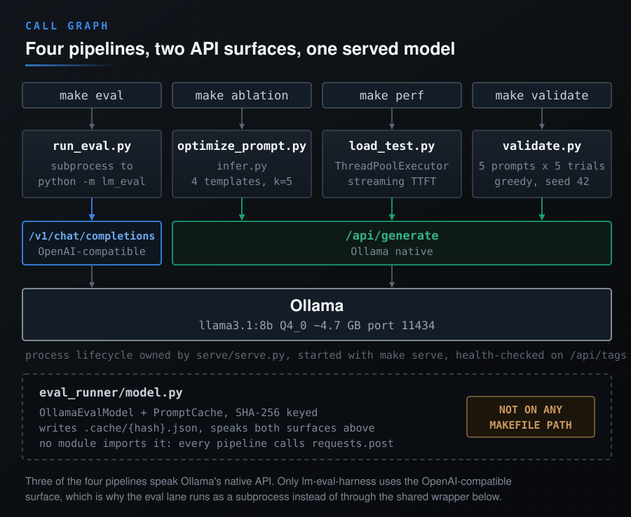

# Architecture

  

## Components

### Benchmark Runner (`eval_runner/`)
Wraps EleutherAI's lm-evaluation-harness with a custom model adapter. Supports MMLU, HellaSwag, and custom JSON-based benchmarks. Results cached via SHA-256 hashed (model, prompt, params) keys.

### Prompt Ablation Engine (`ablation/`)
Systematic comparison of prompting strategies: baseline, instruction template, chain-of-thought, few-shot + CoT, and self-consistency voting. Measures accuracy deltas and statistical significance (McNemar's test, Wilson confidence intervals).

### Load Tester (`perf/`)
Concurrent request generator measuring TTFT, total latency (P50/P95/P99), and throughput (tok/s). Tests across prompt lengths, concurrency levels, and stop-sequence configurations.

### Determinism Validator (`validate/`)
Verifies reproducibility under greedy decoding (temperature=0, top_k=1, fixed seed). Runs N-trial consistency checks and applies output validators (regex, schema, classification).
